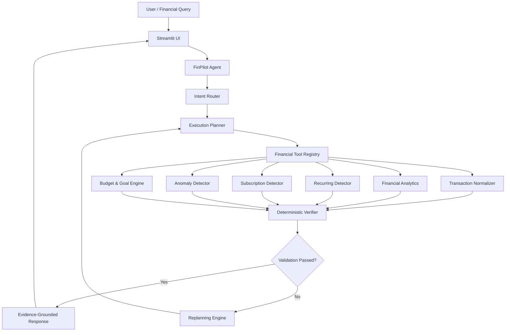

# 🧭 FinPilot — Personal Finance Decision Support Agent

<p align="center">

**An AI-powered financial analysis agent that turns transaction data into verified, explainable financial insights.**

</p>

<p align="center">

[](https://www.python.org/)
[](https://streamlit.io/)
[](#-agentic-workflow)
[](#-financial-safety--privacy)
[](LICENSE)

</p>

---

## 📌 Overview

**FinPilot** is an agentic personal finance decision-support system that analyzes financial transaction data and produces **verifiable, explainable financial insights**.

Instead of simply displaying charts, FinPilot follows an agentic workflow:

> **Observe → Plan → Retrieve → Analyze → Detect → Reason → Act → Verify → Replan → Finalize**

The system combines a deterministic financial analysis engine with an agent orchestration layer to reduce calculation errors and provide transparent evidence for its results.

> **Note:** FinPilot is an educational/demo project. It does not provide professional financial, investment, tax, legal, lending, or insurance advice.

---

## 🎯 Problem

Traditional personal finance applications often focus on displaying historical transactions through dashboards and charts.

Users may still need answers to questions such as:

* Where am I spending the most?
* Which payments are recurring?
* Which subscriptions am I paying for?
* Are there unusual transactions?
* Am I staying within my budget?
* Can my current cash flow support a savings goal?
* What evidence supports the agent's answer?

FinPilot addresses these questions through an **agentic financial analysis workflow** rather than a simple static dashboard.

---

## 💡 Solution

FinPilot provides:

* 📊 Transaction analysis
* 🏷️ Automatic transaction categorization
* 🔄 Recurring payment detection
* 📺 Subscription detection
* 🚨 Financial anomaly detection
* 💰 Budget monitoring
* 🎯 Savings-goal feasibility analysis
* 🤖 Natural-language financial queries
* 🔍 Explainable agent execution traces
* ✅ Deterministic verification
* 🔁 Automatic replanning when verification fails

---

## ✨ Key Features

| Feature                       | Description                                                        |
| ----------------------------- | ------------------------------------------------------------------ |
| 📥 **Transaction Ingestion**  | Reads and normalizes CSV financial transaction data                |
| 🏷️ **Categorization**        | Automatically categorizes transactions into financial categories   |
| 📊 **Financial Analytics**    | Calculates income, expenses, savings and cash flow                 |
| 🔄 **Recurring Detection**    | Identifies recurring payments and financial obligations            |
| 📺 **Subscription Detection** | Detects repeated subscription-style transactions                   |
| 🚨 **Anomaly Detection**      | Identifies unusual transactions using statistical analysis         |
| 💰 **Budget Engine**          | Tracks spending against predefined budgets                         |
| 🎯 **Goal Analysis**          | Evaluates savings-goal feasibility using actual cash flow          |
| 🤖 **Agentic Querying**       | Converts natural-language questions into executable analysis plans |
| 🔍 **Verification**           | Checks financial calculations before producing the final answer    |
| 🔁 **Replanning**             | Re-executes the workflow when validation detects inconsistencies   |
| 📝 **Audit Trace**            | Records tools, execution steps and verification results            |

---

# 🤖 Agentic Workflow

FinPilot is designed around a decision-and-verification loop.

```text
User Question
      ↓
Goal Identification
      ↓
Intent Classification
      ↓
Execution Planning
      ↓
Retrieve Financial Data
      ↓
Run Analytical Tools
      ↓
Analyze Results
      ↓
Verify Calculations
      ↓
   ┌───────────────┐
   │ Verification  │
   │    Passed?    │
   └───────┬───────┘
       Yes │ No
           │
           ↓
     ┌───────────┐
     │ Replanning│
     └─────┬─────┘
           │
           └──────────────→ Execute Again
           
Passed
   ↓
Generate Evidence-Grounded Response
   ↓
Finalize
```

### Example

User asks:

> **"Where did I spend the most this month?"**

FinPilot can create an execution plan such as:

```text
1. Retrieve transactions
2. Calculate category totals
3. Identify highest spending category
4. Verify category totals
5. Generate final response
```

The result is then checked before being presented to the user.

---

# 🏗️ System Architecture



---

# 🧰 Financial Analysis Engines

### 1. Transaction Normalizer

Handles:

* CSV parsing
* Delimiter detection
* Data cleaning
* Transaction type normalization
* Category assignment

Supported categories include:

```text
Housing
Food
Transport
Shopping
Subscription
Utilities
Healthcare
Entertainment
Education
Transfer
Income
```

### 2. Financial Analytics

Calculates:

* Total income
* Total expenses
* Net cash flow
* Savings rate
* Monthly spending
* Category-level spending
* Month-over-month changes

### 3. Recurring Payment Detector

Analyzes:

* Merchant repetition
* Payment intervals
* Amount variation
* Recurring payment patterns

### 4. Subscription Detector

Identifies repeated subscription-style payments such as:

```text
Netflix
Spotify
Software subscriptions
Streaming services
```

### 5. Anomaly Detector

Uses statistical analysis to identify unusually large or unusual transactions.

Example:

```text
Normal spending
      ↓
Calculate baseline
      ↓
Compare transaction
      ↓
Unusual?
   ↙     ↘
 Yes      No
  ↓        ↓
Flag     Normal
```

### 6. Budget & Goal Engine

Tracks:

* Budget utilization
* Remaining budget
* Spending limits
* Monthly surplus
* Required savings
* Goal feasibility

---

# 🔐 Financial Safety & Privacy

> ⚠️ **Important**

FinPilot is a **financial data analysis and decision-support tool**.

It does **not** provide:

* Investment advice
* Stock recommendations
* Cryptocurrency speculation
* Lending recommendations
* Tax strategy
* Insurance advice

Demonstration data should be **synthetic or deidentified**.

The project is designed to perform financial analysis locally without requiring third-party cloud financial-data APIs.

---

# 🛠️ Tech Stack

| Technology             | Purpose                              |
| ---------------------- | ------------------------------------ |
| **Python**             | Core application logic               |
| **Streamlit**          | Interactive web interface            |
| **Pandas**             | Financial data processing            |
| **NumPy**              | Numerical calculations               |
| **Pytest**             | Automated testing                    |
| **CSV**                | Financial transaction input          |
| **Agent Architecture** | Planning, execution and verification |

---

# 📁 Project Structure

```text
finpilot/
│
├── app.py
├── README.md
├── requirements.txt
├── .gitignore
├── .env.example
│
├── agent/
│   ├── __init__.py
│   ├── state.py
│   ├── router.py
│   ├── planner.py
│   ├── verifier.py
│   └── core.py
│
├── tools/
│   ├── __init__.py
│   ├── registry.py
│   ├── normalization.py
│   ├── analytics.py
│   ├── recurring.py
│   ├── anomalies.py
│   └── planning.py
│
├── data/
│   └── sample_transactions.csv
│
└── tests/
    ├── __init__.py
    ├── test_normalization.py
    ├── test_analytics.py
    ├── test_recurring.py
    ├── test_anomalies.py
    └── test_agent.py
```

---

# 🚀 Installation

## Windows

```cmd
git clone https://github.com/your-username/finpilot.git

cd finpilot

python -m venv .venv

.venv\Scripts\activate

python -m pip install --upgrade pip

pip install -r requirements.txt
```

## macOS / Linux

```bash
git clone https://github.com/your-username/finpilot.git

cd finpilot

python3 -m venv .venv

source .venv/bin/activate

pip install --upgrade pip

pip install -r requirements.txt
```

---

# ▶️ Run the Application

```bash
streamlit run app.py
```

Then open:

```text
http://localhost:8501
```

---

# 💬 Example Agent Queries

You can ask FinPilot questions such as:

```text
Where did I spend the most this month?

Which subscriptions am I paying for?

What are my recurring expenses?

Did I have any unusual transactions?

How much did I spend on food?

What is my current monthly cash flow?

Am I within my budget?

Can I achieve my savings goal based on my current cash flow?
```

---

# 📄 CSV Input Format

FinPilot accepts transaction data using the following structure:

```csv
date,description,amount,category,account,type
2026-09-01,Salary Credited,65000.00,Income,HDFC Bank,credit
2026-09-02,House Rent Payment,15000.00,Housing,HDFC Bank,debit
2026-09-05,Netflix Subscription,649.00,Subscription,Credit Card,debit
2026-09-07,Luxury Watch Retail,24500.00,Shopping,Credit Card,debit
```

### Required Columns

```text
date
description
amount
```

### Optional Columns

```text
category
account
type
```

---

# 🧪 Testing

Run the complete test suite:

```bash
pytest -v
```

The tests cover:

* CSV parsing
* Transaction categorization
* Financial calculations
* Recurring payments
* Subscription detection
* Anomaly detection
* Agent workflows
* Verification logic

---

# 🎬 Demo Flow

For a 3–5 minute demonstration:

### 1. Launch FinPilot

Show the Streamlit dashboard.

### 2. Load Financial Data

Load the synthetic transaction dataset.

### 3. Ask the Agent

Example:

> "Where did I spend the most this month?"

### 4. Show the Agent Trace

Demonstrate:

```text
Intent
  ↓
Plan
  ↓
Tool Calls
  ↓
Analysis
  ↓
Verification
  ↓
Final Answer
```

### 5. Demonstrate Anomaly Detection

Show unusual transactions identified by the system.

### 6. Demonstrate Budget & Goals

Show budget utilization and savings-goal analysis.

### 7. Show Verification

Demonstrate that calculations are checked before the final response.

---

# 🗺️ Future Roadmap

* [ ] Bank statement PDF parsing
* [ ] Multi-currency support
* [ ] Optional local LLM support with Ollama/GGUF
* [ ] PDF financial reports
* [ ] More advanced financial pattern detection
* [ ] Additional visualization dashboards
* [ ] Improved natural-language query support

---

# 📜 License

This project is licensed under the **MIT License**.

See [`LICENSE`](LICENSE) for details.

---

## ⚠️ Disclaimer

**FinPilot is an educational and research project.**

It provides automated financial data analysis and decision support based on the information supplied by the user. It should not be used as a substitute for professional financial, investment, tax, legal, lending, or insurance advice.

**Use synthetic or deidentified financial data for demonstrations and testing.**
